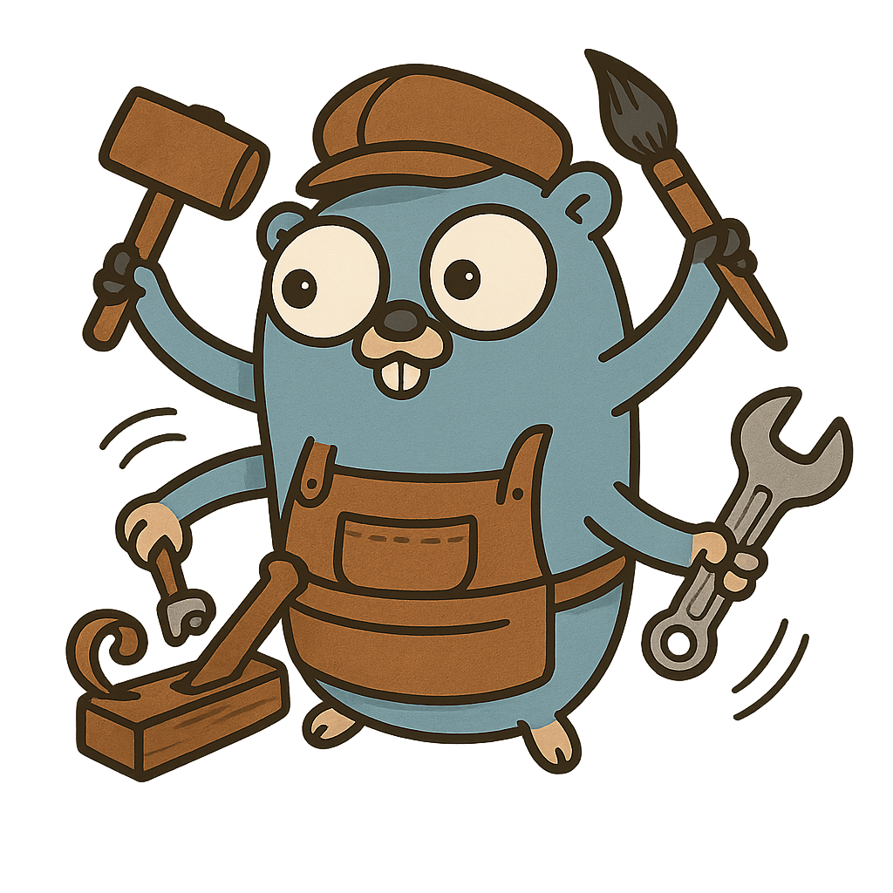

# Artisan 🎨

<p align="center">
  
</p>

[](https://opensource.org/licenses/MIT)

Artisan is a lightweight, type-safe worker pool implementation for Go that helps you process tasks concurrently with ease. Built with generics, it provides a simple yet powerful API for handling concurrent task processing while maintaining type safety.

## Installation

```bash
go get github.com/tiagovaldrich/artisan
```

## Quick Start

Here's a simple example of how to use Artisan:

```go
package main

import (
    "context"
    "fmt"
    "time"

    "github.com/tiagovaldrich/artisan"
)

func main() {
    // Create a worker pool with 3 workers
    pool := artisan.NewWorkerpool[int](
        3,
        artisan.WithHandler[int](func(ctx context.Context, task int) error {
            // Simulate some work
            time.Sleep(100 * time.Millisecond)
            fmt.Printf("Processed task: %d\n", task)
            return nil
        }),
    )

    // Start the worker pool
    ctx := context.Background()
    pool.Start(ctx)

    // Process some tasks
    tasks := []int{1, 2, 3, 4, 5, 6, 7, 8, 9, 10}
    pool.Process(tasks...)

    // Wait for all tasks to complete
    pool.Wait()

    // Shutdown the pool gracefully
    pool.Shutdown()
}
```

## Advanced Usage

### Error Handling

```go
pool := artisan.NewWorkerpool[int](
    3,
    artisan.WithHandler[int](func(ctx context.Context, task int) error {
        if task == 0 {
            return fmt.Errorf("cannot process zero")
        }
        return nil
    }),
    artisan.WithErrorHandler[int](func(err error) {
        log.Printf("Error processing task: %v", err)
    }),
)
```

### Context Cancellation

```go
ctx, cancel := context.WithTimeout(context.Background(), 5*time.Second)
defer cancel()

pool.Start(ctx)
// Pool will stop processing new tasks when context expires
```

### Panic Recovery

Artisan automatically recovers from panics in worker routines:

```go
pool := artisan.NewWorkerpool[int](
    2,
    artisan.WithHandler[int](func(ctx context.Context, task int) error {
        if task == 3 {
            panic("something went wrong")
        }
        return nil
    }),
    artisan.WithErrorHandler[int](func(err error) {
        // Panics are converted to errors and handled here
        fmt.Printf("Recovered from panic: %v\n", err)
    }),
)
```

## API Reference

### Creating a Worker Pool

```go
func NewWorkerpool[Task any](size int, options ...WorkerpoolOption[Task]) *Workerpool[Task]
```

Options:

- `WithHandler[Task]` - Set the task processing function
- `WithErrorHandler[Task]` - Set the error handling function

### Methods

- `Start(ctx context.Context)` - Start the worker pool
- `Process(tasks ...Task) error` - Submit tasks for processing
- `Wait() error` - Wait for all submitted tasks to complete
- `Shutdown() error` - Gracefully shutdown the worker pool
- `GetAproximatedTasksWaiting() int` - Get the approximate number of tasks waiting to be processed

## Contributing

Contributions are welcome! Please feel free to submit a Pull Request.

## License

This project is licensed under the MIT License - see the [LICENSE](LICENSE) file for details.
